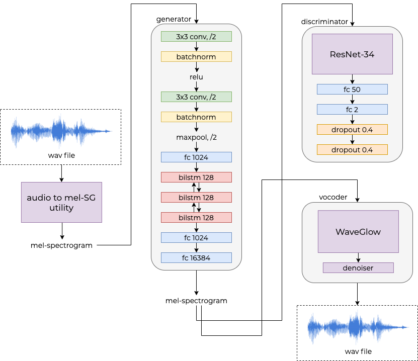

# unbabel
an exploration of accent transfer using deep learning

# Introduction
Originally proposed in the visual domain, style transfer refers to the changing of an image or video to adopt the visual style of another image or video (for example, modifying a painting by Monet to look as though it had been painted by Van Gogh). As attempts at performing visual style transfer have become more successful with the use of deep learning models, parallel efforts have emerged in the audio domain. For the audio modality, style transfer constitutes changing the style of an audio sequence to sound as though it were produced by another audio source. Tasks often explored include changing music played by one instrument to sound as if it has been played by another or changing a spoken utterance to sound as if it were spoken by someone else (voice conversion).

In this project, we explore the following question:

* Can we modify an utterance spoken in Accent A (American English) to sound as though it is spoken in Accent B (British English)?

Note that, we distinguish accent from other aspects of utterance delivery like emotion, tone, and emphasis in that the intent and meaning of the utterance remains exactly the same, as does the vocal quality of the speaker.

To accomplish this goal, we draw inspiration from prior work that uses generative models and autoencoders to perform image style transfer. We propose an architecture with separate ground truth-trained generators and discriminators, which emulates a GAN-like structure without the use of random noise to generate fake data.

Our work consists of the following contributions:

* A dataset of approximately 30,000 parallel spoken utterances constructed using unique words from the New York Times, from which we synthesize words in the American and British English accents, using Amazon Polly.
* A custom designed network architecture that takes as input a spoken utterance in American or British English and produces audio of the same utterance spoken in the target accent.

# Architecture Diagram

